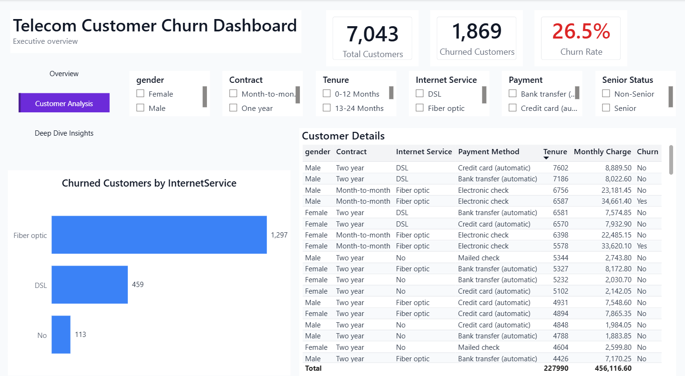
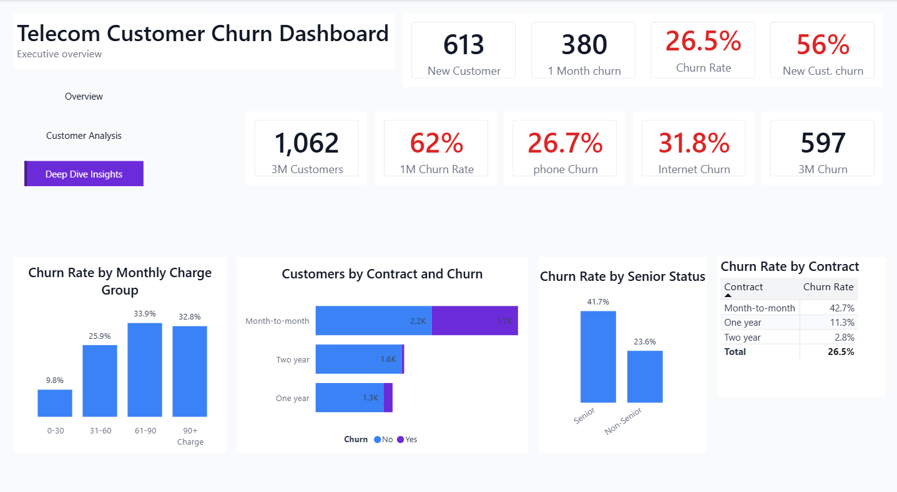

# 📡 Telecom Customer Churn Dashboard

<p align="center">
  
</p>

An interactive **Business Intelligence Dashboard** built with **Power BI** to analyze customer churn in the telecommunications industry. The project leverages **Power Query**, **DAX**, and **data modeling** to transform raw customer data into meaningful insights that support data-driven business decisions and improve customer retention strategies.

---

# 📑 Table of Contents

- Project Overview
- Business Objectives
- Dashboard KPIs
- Dashboard Pages
- Tools & Technologies
- Dataset
- Key Features
- Business Questions Answered
- Key Business Insights
- Skills Demonstrated
- Business Value
- Repository Structure
- How to View the Dashboard
- Future Improvements
- Author

---

# 📌 Project Overview

Customer churn is one of the most critical challenges facing telecommunications companies because retaining existing customers is significantly more cost-effective than acquiring new ones.

This dashboard provides a comprehensive analysis of customer demographics, contract types, subscribed services, payment methods, and customer tenure to identify churn patterns and support customer retention initiatives through interactive business intelligence reporting.

---

# 🎯 Business Objectives

- Analyze customer churn trends.
- Monitor key business KPIs.
- Identify high-risk customer segments.
- Explore the relationship between customer services and churn.
- Analyze contract types and payment methods.
- Support business decision-making through interactive visualizations.

---

# 📊 Dashboard KPIs

- Total Customers
- Churned Customers
- Churn Rate
- Average Monthly Charges
- Average Total Charges
- Average Customer Tenure

---

# 🛠️ Tools & Technologies

- Power BI Desktop
- Power Query
- DAX
- Data Modeling
- Calculated Columns
- Custom Columns
- Data Visualization
- Interactive Reporting

---

# 📈 Dashboard Pages

## 1️⃣ Executive Overview

Provides a high-level overview of customer distribution, business performance, and key churn KPIs.

### Highlights

- Customer Overview
- Churn KPIs
- Customer Distribution
- Contract Analysis
- Service Distribution
- Payment Method Analysis

---

## 2️⃣ Customer Analysis

Analyzes customer demographics, subscribed services, payment methods, and contract distribution to better understand customer behavior.

<p align="center">

</p>

---

## 3️⃣ Deep Dive Insights

Explores the primary factors influencing customer churn, helping identify business opportunities to improve customer retention.

<p align="center">

</p>

---

# 📂 Dataset

The dashboard is built using a telecommunications customer dataset containing customer-level information, including:

- Customer ID
- Gender
- Senior Citizen
- Partner
- Dependents
- Tenure
- Phone Service
- Internet Service
- Online Security
- Tech Support
- Contract Type
- Payment Method
- Monthly Charges
- Total Charges
- Churn Status

---

# 📊 Key Features

- Executive KPI Cards
- Interactive Slicers
- Customer Segmentation
- Churn Rate Analysis
- Service Type Analysis
- Contract Analysis
- Payment Method Analysis
- Customer Tenure Analysis
- Interactive Navigation
- Drill-down Insights

---

# ❓ Business Questions Answered

- Which customer segments have the highest churn rate?
- Which contract types experience the highest customer churn?
- How does customer tenure affect churn behavior?
- Which payment methods are associated with higher churn?
- Which services contribute most to customer retention?
- How do demographic characteristics influence churn?

---

# 💡 Key Business Insights

- Customers with month-to-month contracts experience the highest churn rate.
- Customers with shorter tenure are significantly more likely to leave.
- Electronic Check is associated with higher churn compared to other payment methods.
- Customers without Online Security or Tech Support are more likely to churn.
- Long-term contracts contribute to stronger customer retention.

---

# 💼 Skills Demonstrated

- Business Intelligence Reporting
- Customer Churn Analysis
- Dashboard Design
- KPI Development
- Data Cleaning
- Data Transformation
- Data Modeling
- DAX Measures
- Power Query
- Interactive Reporting
- Business Analysis
- Data Storytelling

---

# 💼 Business Value

This dashboard enables stakeholders to:

- Monitor customer churn performance.
- Identify customer segments with high churn risk.
- Understand the key drivers behind customer attrition.
- Improve customer retention strategies.
- Support strategic business decisions through interactive analytics.

---

# 📂 Repository Structure

```text
Telecom-Customer-Churn-Dashboard
│
├── README.md
├── Telecom_Customer_Churn.pdf
├── 1_Executive_overview.png
├── 2_Customer_Analysis.png
└── 3_Deep_Dive_Insights.png
```

> **Note:** The Power BI (.pbix) file is intentionally not included in this repository.

---

# 🚀 How to View the Dashboard

1. Download or clone the repository.
2. Open **Telecom_Customer_Churn.pdf** to explore all dashboard pages.
3. Browse the dashboard screenshots for a quick overview of each report page.
4. Review the interactive dashboards to understand customer churn patterns and business insights.

---

# 🔮 Future Improvements

- Customer Churn Prediction using Machine Learning
- Customer Lifetime Value (CLV) Analysis
- Customer Segmentation Dashboard
- Executive Summary Dashboard
- Automated Data Refresh using Power BI Service

---

# 👤 Author

**Omnia Mohamed**

**Aspiring Data Analyst**

- 💼 LinkedIn: https://www.linkedin.com/in/omnia26
- 🐙 GitHub: https://github.com/omnia-mohamed26

---

⭐ If you found this project useful, consider giving it a **Star** on GitHub.
