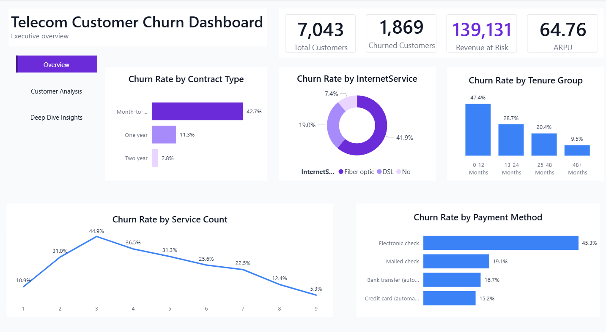

# 📊 Telecom Customer Churn Dashboard

## 📌 Project Overview

This Business Intelligence project was developed using **Power BI** to analyze customer churn in the telecommunications industry. The dashboard provides interactive visualizations and key performance indicators (KPIs) to help stakeholders understand customer behavior, identify churn patterns, and support data-driven decision-making.

---

## 🎯 Project Objectives

- Analyze customer churn trends.
- Monitor key business KPIs.
- Identify high-risk customer segments.
- Evaluate the impact of services, contracts, and payment methods on customer churn.
- Support strategic business decisions through interactive dashboards.

---

## 🛠️ Tools & Technologies

- Power BI
- Power Query
- DAX
- Calculated Columns
- Custom Columns
- Data Modeling

---

## 📈 Dashboard Pages

### 1. Executive Overview
Provides an executive summary of customer churn with key KPIs and high-level business insights.

---

### 2. Customer Analysis
Analyzes customer demographics, service subscriptions, payment methods, and contract types.

---

### 3. Churn Analysis
Explores the major factors influencing customer churn, including tenure, monthly charges, internet services, and contract types.

---

## 📂 Repository Contents

- Telecom_Customer_Churn.pdf
- 1_Executive_overview.png
- 2_Customer_Analysis.png
- 3_Churn_Analysis.png
- README.md

---

## 💼 Business Value

This dashboard enables decision-makers to:

- Track customer churn performance.
- Identify customer segments with high churn risk.
- Discover key drivers behind customer attrition.
- Support retention strategies using data-driven insights.

---

## 👩‍💻 Developed By

**Omnia Mohamed**

Power BI | Data Analytics | Business Intelligence
